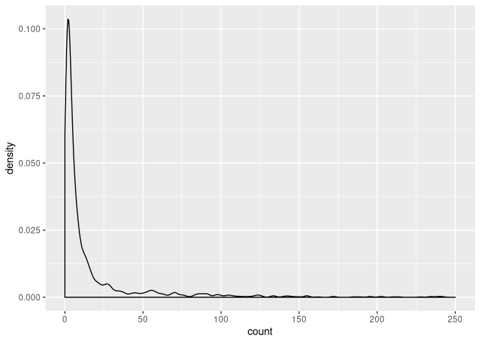

<!-- README.md is generated from README.Rmd. Please edit that file -->

# org.HsSimple.eg.db

<!-- badges: start -->

<!-- badges: end -->

Genome wide annotation for Homo sSimple, primarily based on mapping
using Entrez Gene identifiers.

## Installation

To install this package, you need to download latest archive from
[release
page](https://github.com/bioinformatist/org.HsSimple.eg.db/releases),
then run command like:

``` r
install.packages("./org.HsSimple.eg.db", repos=NULL)
```

## How can we build this simple database?

Firstly, GO terms in BP and MF ontologies with too many genes were
filtered out, for these terms play more general rules which can be
represented by other finer terms.

``` r
library(data.table)
library(ggplot2)
suppressMessages(library(tidyverse))  # For pipe
suppressMessages(library(org.Hs.eg.db))

BP.terms <- as.data.table(AnnotationDbi::select(org.Hs.eg.db, keys = 'BP', columns = c('GO', 'ENTREZID'), keytype = "ONTOLOGY"))
#> 'select()' returned 1:many mapping between keys and columns
BP.terms[, ONTOLOGY := NULL]
BP.terms <- unique(BP.terms, by = c('GO', 'ENTREZID'))
length(unique(BP.terms$ENTREZID))
#> [1] 18493
BP.terms[, count := .N, by = GO]
setorder(BP.terms, -count)
(BP.terms.uniq <- unique(BP.terms, by = 'GO'))
#>                GO EVIDENCE  ENTREZID count
#>     1: GO:0006357      IDA        20  1132
#>     2: GO:0007186      IMP        19  1116
#>     3: GO:0045944      IDA        90  1107
#>     4: GO:0007165      TAS        27   902
#>     5: GO:0000122      IGI        93   809
#>    ---                                    
#> 12074: GO:0019679      IBA    730249     1
#> 12075: GO:0032597      IDA 100133941     1
#> 12076: GO:0032600      ISS 100133941     1
#> 12077: GO:0032913      IMP 100133941     1
#> 12078: GO:0090133      ISS 100506013     1
ggplot() + geom_density(data = BP.terms.uniq, aes(count)) + scale_x_continuous(breaks = seq.int(0, 80, 10), labels = seq.int(0, 80, 10), limits = c(0, 100))
#> Warning: Removed 172 rows containing non-finite values (stat_density).
```


``` r
BP.terms <- BP.terms[count < 80]
BP.terms[, count := NULL]
setnames(BP.terms, 3, 'GID')
setcolorder(BP.terms, c('GID', 'GO', 'EVIDENCE'))
go.gene <- dcast(BP.terms, GO ~ GID)
#> Using 'EVIDENCE' as value column. Use 'value.var' to override
for (j in 2:ncol(go.gene)) set(go.gene, which(!is.na(go.gene[[j]])), j, 1L)
for (j in 2:ncol(go.gene)) set(go.gene, which(is.na(go.gene[[j]])), j, 0L)
go.gene <- go.gene[, lapply(.SD, as.numeric), by = GO]
go.gene <- as.data.frame(go.gene) %>% remove_rownames %>% column_to_rownames(var = "GO")

# For it takes too long to run, I saved the result for reusing
# library(vegan)
# BP.jaccard <- 1 - vegdist(go.gene, method = "jaccard")
load('BP.jaccard.xz')
BP.jaccard <- as.matrix(BP.jaccard)
BP.jaccard[!upper.tri(BP.jaccard)] <- 0
BP.jaccard <- as.data.table(BP.jaccard, keep.rownames = 'GO')
BP.jaccard <- melt(BP.jaccard, id.vars = 'GO')
BP.jaccard <- merge(BP.jaccard, BP.terms.uniq, by.x = 'GO', by.y = 'GO')
BP.jaccard[, `:=`(EVIDENCE = NULL, ENTREZID = NULL)]
setnames(BP.jaccard, c('GO', 'variable', 'count'), c('GO_1', 'GO_2', 'GO_1_count'))
BP.jaccard <- merge(BP.jaccard, BP.terms.uniq, by.x = 'GO_2', by.y = 'GO')
BP.jaccard[, `:=`(EVIDENCE = NULL, ENTREZID = NULL)]
setnames(BP.jaccard, 'count', 'GO_2_count')
# Should mark redundant GO terms as "to be removed" here, or all of them will be kept
BP.jaccard[, remove := ifelse(value > 0.9, ifelse(GO_1_count > GO_2_count, GO_1, GO_2), NA), by = .I]
to.remove <- unique(na.omit(BP.jaccard), by = 'remove')
BP.terms <- BP.terms[setdiff(GO, to.remove[['remove']]), on = 'GO']

CC.terms <- as.data.table(AnnotationDbi::select(org.Hs.eg.db, keys = 'CC', columns = c('GO', 'ENTREZID'), keytype = "ONTOLOGY"))
#> 'select()' returned 1:many mapping between keys and columns
CC.terms[, ONTOLOGY := NULL]
CC.terms <- unique(CC.terms, by = c('GO', 'ENTREZID'))
length(unique(CC.terms$ENTREZID))
#> [1] 19659
CC.terms[, count := .N, by = GO]
setorder(CC.terms, -count)
(CC.terms.uniq <- unique(CC.terms, by = 'GO'))
#>               GO EVIDENCE ENTREZID count
#>    1: GO:0005634      TAS       12  5437
#>    2: GO:0005829      TAS        2  4988
#>    3: GO:0005886      IEA       14  4481
#>    4: GO:0005737      IBA       15  4353
#>    5: GO:0016021      IEA       13  3648
#>   ---                                   
#> 1719: GO:0097543      IEA   284086     1
#> 1720: GO:0031259      IDA   388325     1
#> 1721: GO:0043601      IBA   389643     1
#> 1722: GO:0060473      IBA   431705     1
#> 1723: GO:0061495      IBA   440145     1
ggplot() + geom_density(data = CC.terms.uniq, aes(count)) + scale_x_continuous(limits = c(0, 250))
#> Warning: Removed 46 rows containing non-finite values (stat_density).
```



``` r
CC.terms <- CC.terms[count < 175]
CC.terms[, count := NULL]
setnames(CC.terms, 3, 'GID')
setcolorder(CC.terms, c('GID', 'GO', 'EVIDENCE'))
go.gene <- dcast(CC.terms, GO ~ GID)
#> Using 'EVIDENCE' as value column. Use 'value.var' to override
for (j in 2:ncol(go.gene)) set(go.gene, which(!is.na(go.gene[[j]])), j, 1L)
for (j in 2:ncol(go.gene)) set(go.gene, which(is.na(go.gene[[j]])), j, 0L)
go.gene <- go.gene[, lapply(.SD, as.numeric), by = GO]
go.gene <- as.data.frame(go.gene) %>% remove_rownames %>% column_to_rownames(var = "GO")

# CC.jaccard <- 1 - vegdist(go.gene, method = "jaccard")
load('CC.jaccard.xz')
CC.jaccard <- as.matrix(CC.jaccard)
CC.jaccard[!upper.tri(CC.jaccard)] <- 0
CC.jaccard <- as.data.table(CC.jaccard, keep.rownames = 'GO')
CC.jaccard <- melt(CC.jaccard, id.vars = 'GO')
CC.jaccard <- merge(CC.jaccard, CC.terms.uniq, by.x = 'GO', by.y = 'GO')
CC.jaccard[, `:=`(EVIDENCE = NULL, ENTREZID = NULL)]
setnames(CC.jaccard, c('GO', 'variable', 'count'), c('GO_1', 'GO_2', 'GO_1_count'))
CC.jaccard <- merge(CC.jaccard, CC.terms.uniq, by.x = 'GO_2', by.y = 'GO')
CC.jaccard[, `:=`(EVIDENCE = NULL, ENTREZID = NULL)]
setnames(CC.jaccard, 'count', 'GO_2_count')
CC.jaccard[, remove := ifelse(value > 0.9, ifelse(GO_1_count > GO_2_count, GO_1, GO_2), NA), by = .I]
to.remove <- unique(na.omit(CC.jaccard), by = 'remove')
CC.terms <- CC.terms[setdiff(GO, to.remove[['remove']]), on = 'GO']

MF.terms <- as.data.table(AnnotationDbi::select(org.Hs.eg.db, keys = 'MF', columns = c('GO', 'ENTREZID'), keytype = "ONTOLOGY"))
#> 'select()' returned 1:many mapping between keys and columns
MF.terms[, ONTOLOGY := NULL]
setnames(MF.terms, 3, 'GID')
setcolorder(MF.terms, c('GID', 'GO', 'EVIDENCE'))

hGO <- rbind(BP.terms, CC.terms, MF.terms)
```

And package directory was built:

``` r
AnnotationForge::makeOrgPackage(go = hGO,
               version = "1.0.0",
               maintainer = "Yu Sun <suny226@mail2.sysu.edu.cn>",
               author = "Yu Sun <suny226@mail2.sysu.edu.cn>",
               outputDir = ".",
               tax_id = "9606",
               genus = "Homo",
               species = "sSimple",
               goTable = 'go')
```

We modified the [`zzz.R`](R/zzz.R), first the `dbFileConnect()` function
was reloaded for a **read-and-write** connection instead of read-only
mode:

``` r
dbFileConnect <- function (dbfile)
{
  if (!file.exists(dbfile))
    stop("DB file '", dbfile, "' not found")
  if (.Platform$OS.type == "unix") {
    DBI::dbConnect(RSQLite::SQLite(), dbname = dbfile, cache_size = 64000L,
                   synchronous = "off", flags = RSQLite::SQLITE_RW, vfs = "unix-none")
  }
  else {
    DBI::dbConnect(RSQLite::SQLite(), dbname = dbfile, cache_size = 64000L,
                   synchronous = "off", flags = RSQLite::SQLITE_RW)
  }
}
```

Then, we renamed fields in tables `go_bp`, `go_mf`, `go_cc` and `genes`,
for column names provided by `AnnotationForge` package are
**incompatible** with functions in `topGO`
package.

``` r
tryCatch(DBI::dbSendQuery(dbconn, 'ALTER TABLE genes RENAME COLUMN GID to gene_id'), error=function(e) NULL)
lapply(c('go_bp', 'go_cc', 'go_mf'), function(x) tryCatch(DBI::dbSendQuery(dbconn, paste0('ALTER TABLE ', x, ' RENAME COLUMN GO to go_id')), error=function(e) NULL))
```

Finally, the package root directory was packed and published：

``` bash
tar cf - org.HsSimple.eg.db | pbzip2 -r > org.HsSimple.eg.db.tar.xz
```

For instance, `org.HsSimple.eg.db` can be queried directly as an
argument of `topGO::annFUN.org()` as below:

``` r
library(org.HsSimple.eg.db)
topGO::annFUN.org('BP', feasibleGenes = x, mapping = 'org.HsSimple.eg.db', ID = "entrez")
```

while `x` stands for an Entrez gene ID.

## GO - Entrez mapping relationship R object

For special use, we also packaged an R object with xz compression:

``` r
BP.terms[, Onto := 'BP']
MF.terms[, Onto := 'MF']
CC.terms[, Onto := 'CC']
hGO <- rbind(BP.terms, CC.terms, MF.terms)
hGO[, EVIDENCE:=NULL]
hGO[, count := .N, by = GO]
setkey(hGO, count)
hGO <- hGO[!.(1)]
save(hGO, file = 'hGO.xz', compress = 'xz')
```

## Contributions

[Yu Sun](https://github.com/bioinformatist/) (maintainer) designed and
implemented the database. [Shuang
Deng](https://github.com/dengshuang0116/) calculated all Jaccard
similarity distance.

## Acknowledgment

We thank Ms. Crystal Zhou of A.S. Wastons Group for her professional
writing advice.
